# Java 设计模式详解：21 种经典模式的结构、场景与代码示例

> 本文只讲设计模式本身：它解决什么问题、结构是什么、Java 中如何落地、什么时候该用、什么时候别滥用。
>
> 文中的类名、对象名和流程均为通用示例，不绑定任何具体行业、公司、产品或项目。
>
> 配套 PlantUML（`@startuml`…`@enduml`）类图与流程图，可直接复制到支持 PlantUML 的工具中渲染。
>
> **渲染方式**
> - VS Code 插件：`jebbs.plantuml`
> - IntelliJ 插件：`PlantUML integration`
> - 命令行：`java -jar plantuml.jar design-patterns.md -tpng`
> - 在线：https://www.plantuml.com/plantuml

---

## 目录

### 一、创建型模式（Creational，5）
1. [单例模式 Singleton](#1-单例模式singleton)
2. [工厂方法模式 Factory Method](#2-工厂方法模式factory-method)
3. [抽象工厂模式 Abstract Factory](#3-抽象工厂模式abstract-factory)
4. [建造者模式 Builder](#4-建造者模式builder)
5. [原型模式 Prototype](#5-原型模式prototype)

### 二、结构型模式（Structural，7）
6. [适配器模式 Adapter](#6-适配器模式adapter)
7. [桥接模式 Bridge](#7-桥接模式bridge)
8. [组合模式 Composite](#8-组合模式composite)
9. [装饰器模式 Decorator](#9-装饰器模式decorator)
10. [外观模式 Facade](#10-外观模式facade)
11. [享元模式 Flyweight](#11-享元模式flyweight)
12. [代理模式 Proxy](#12-代理模式proxy)

### 三、行为型模式（Behavioral，9）
13. [职责链模式 Chain of Responsibility](#13-职责链模式chain-of-responsibility)
14. [命令模式 Command](#14-命令模式command)
15. [迭代器模式 Iterator](#15-迭代器模式iterator)
16. [中介者模式 Mediator](#16-中介者模式mediator)
17. [备忘录模式 Memento](#17-备忘录模式memento)
18. [观察者模式 Observer](#18-观察者模式observer)
19. [状态模式 State](#19-状态模式state)
20. [策略模式 Strategy](#20-策略模式strategy)
21. [模板方法模式 Template Method](#21-模板方法模式template-method)

### 附录
- [附录 A：21 种模式速查表](#附录-a21-种模式速查表)
- [附录 B：模式关系图](#附录-b模式关系图)
- [附录 C：选型决策流程](#附录-c选型决策流程)
- [附录 D：常见误区](#附录-d常见误区)
- [附录 E：PlantUML 颜色约定](#附录-eplantuml-颜色约定)

---

# 一、创建型模式（Creational Patterns）

> 创建型模式关注“对象如何被创建”。它们把对象的构造过程和使用过程解耦，让代码更容易扩展、替换和测试。

## 1. 单例模式（Singleton）

**意图**：保证一个类只有一个实例，并提供一个全局访问点。

### 类图

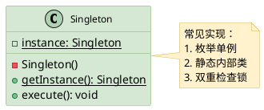

### Java 示例

```java
public final class AppRegistry {
    private AppRegistry() {}

    private static class Holder {
        private static final AppRegistry INSTANCE = new AppRegistry();
    }

    public static AppRegistry getInstance() {
        return Holder.INSTANCE;
    }

    public void register(String key, Object value) {
        // 保存全局对象引用
    }
}
```

### 适用场景
- 全局配置、注册表、共享资源管理器。
- 对象创建成本较高，并且确实只需要一个实例。
- 需要统一入口管理某类公共能力。

### 注意事项
- 不要把单例当成“全局变量垃圾桶”。
- 多线程环境要考虑安全发布问题。
- 分布式系统中的“唯一”不能靠进程内单例保证。

---

## 2. 工厂方法模式（Factory Method）

**意图**：定义创建对象的接口，把具体创建过程延迟到子类。

### 类图

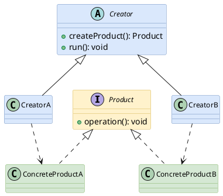

### Java 示例

```java
interface Product {
    void operation();
}

class TextProduct implements Product {
    public void operation() {
        System.out.println("text product");
    }
}

class BinaryProduct implements Product {
    public void operation() {
        System.out.println("binary product");
    }
}

abstract class Creator {
    public void run() {
        Product product = createProduct();
        product.operation();
    }

    protected abstract Product createProduct();
}

class TextCreator extends Creator {
    protected Product createProduct() {
        return new TextProduct();
    }
}

class BinaryCreator extends Creator {
    protected Product createProduct() {
        return new BinaryProduct();
    }
}
```

### 适用场景
- 需要根据不同子类创建不同产品。
- 创建逻辑不希望散落在业务代码中。
- 框架定义流程，扩展方提供具体对象。

### 注意事项
- 产品种类很少且不会扩展时，简单构造函数更直接。
- 子类过多会增加类数量，需要结合包结构控制复杂度。

---

## 3. 抽象工厂模式（Abstract Factory）

**意图**：创建一组相关或相互依赖的对象族，而不指定它们的具体类。

### 类图

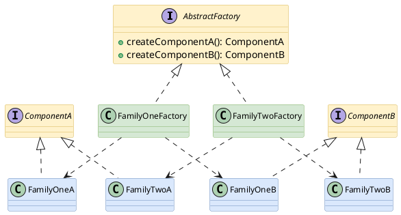

### Java 示例

```java
interface WidgetFactory {
    Button createButton();
    Panel createPanel();
}

interface Button { void click(); }
interface Panel { void render(); }

class LightWidgetFactory implements WidgetFactory {
    public Button createButton() { return new LightButton(); }
    public Panel createPanel() { return new LightPanel(); }
}

class DarkWidgetFactory implements WidgetFactory {
    public Button createButton() { return new DarkButton(); }
    public Panel createPanel() { return new DarkPanel(); }
}

class LightButton implements Button { public void click() {} }
class DarkButton implements Button { public void click() {} }
class LightPanel implements Panel { public void render() {} }
class DarkPanel implements Panel { public void render() {} }
```

### 适用场景
- 需要保证一组对象风格一致、版本一致或协议一致。
- 客户端只依赖抽象接口，不关心具体实现族。
- 需要整体切换一批对象实现。

### 注意事项
- 新增“产品族”容易，新增“产品等级”较麻烦。
- 如果只创建单个对象，用工厂方法或简单工厂即可。

---

## 4. 建造者模式（Builder）

**意图**：把复杂对象的构建过程拆分为多个步骤，使同样的构建过程可以创建不同表示。

### 类图

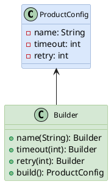

### Java 示例

```java
public class ProductConfig {
    private final String name;
    private final int timeout;
    private final int retry;

    private ProductConfig(Builder builder) {
        this.name = builder.name;
        this.timeout = builder.timeout;
        this.retry = builder.retry;
    }

    public static class Builder {
        private String name = "default";
        private int timeout = 1000;
        private int retry = 0;

        public Builder name(String name) {
            this.name = name;
            return this;
        }

        public Builder timeout(int timeout) {
            this.timeout = timeout;
            return this;
        }

        public Builder retry(int retry) {
            this.retry = retry;
            return this;
        }

        public ProductConfig build() {
            return new ProductConfig(this);
        }
    }
}
```

### 适用场景
- 构造参数多，且有较多可选参数。
- 对象希望不可变，但创建过程又需要逐步配置。
- 创建过程需要校验或默认值填充。

### 注意事项
- 简单对象不要强行 Builder 化。
- Builder 中应集中做参数校验，避免构建出半成品对象。

---

## 5. 原型模式（Prototype）

**意图**：通过复制已有对象创建新对象，避免重复复杂初始化。

### 类图

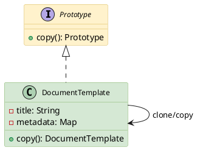

### Java 示例

```java
class DocumentTemplate implements Cloneable {
    private String title;
    private Map<String, String> metadata = new HashMap<>();

    public DocumentTemplate copy() {
        DocumentTemplate clone = new DocumentTemplate();
        clone.title = this.title;
        clone.metadata = new HashMap<>(this.metadata);
        return clone;
    }
}
```

### 适用场景
- 对象初始化成本高，可以先准备模板对象。
- 需要在运行时动态复制不同配置的对象。
- 对象结构稳定，但实例内容经常变化。

### 注意事项
- 注意深拷贝和浅拷贝区别。
- 包含文件、连接、线程等资源时，不应简单复制引用。

---

# 二、结构型模式（Structural Patterns）

> 结构型模式关注“类和对象如何组合”。它们帮助我们在不破坏原有对象的情况下，扩展能力、适配接口、组织层级或降低耦合。

## 6. 适配器模式（Adapter）

**意图**：把一个类的接口转换成客户端期望的另一个接口，使原本接口不兼容的对象可以协同工作。

### 类图

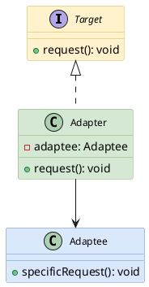

### Java 示例

```java
interface TargetClientApi {
    void request();
}

class LegacyService {
    void specificRequest() {
        System.out.println("legacy call");
    }
}

class ServiceAdapter implements TargetClientApi {
    private final LegacyService legacyService;

    ServiceAdapter(LegacyService legacyService) {
        this.legacyService = legacyService;
    }

    public void request() {
        legacyService.specificRequest();
    }
}
```

### 适用场景
- 新旧接口不兼容，但旧对象仍然有价值。
- 接入第三方库或历史模块时，希望隔离差异。
- 需要统一多个实现的调用入口。

### 注意事项
- 适配器太多可能说明抽象层设计需要重审。
- 不要在适配器中塞入大量业务逻辑，保持转换职责清晰。

---

## 7. 桥接模式（Bridge）

**意图**：将抽象部分与实现部分分离，使二者可以独立变化。

### 类图

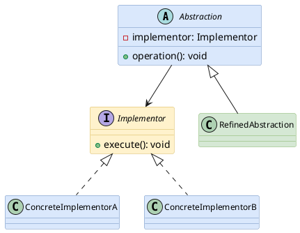

### Java 示例

```java
interface Renderer {
    void render(String content);
}

class ConsoleRenderer implements Renderer {
    public void render(String content) {
        System.out.println(content);
    }
}

class JsonRenderer implements Renderer {
    public void render(String content) {
        System.out.println("{"value":"" + content + ""}");
    }
}

abstract class Message {
    protected final Renderer renderer;

    protected Message(Renderer renderer) {
        this.renderer = renderer;
    }

    abstract void show(String text);
}

class PlainMessage extends Message {
    PlainMessage(Renderer renderer) { super(renderer); }

    void show(String text) {
        renderer.render(text);
    }
}
```

### 适用场景
- 一个对象有两个或多个独立变化维度。
- 不希望用继承组合出大量子类。
- 抽象层和实现层都需要独立扩展。

### 注意事项
- 过早使用会增加理解成本。
- 关键是识别“变化维度”，而不是为了套模式而拆类。

---

## 8. 组合模式（Composite）

**意图**：把对象组织成树形结构，让客户端以一致方式处理单个对象和对象集合。

### 类图

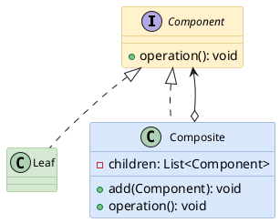

### Java 示例

```java
interface Node {
    void print(String indent);
}

class TextNode implements Node {
    private final String text;
    TextNode(String text) { this.text = text; }

    public void print(String indent) {
        System.out.println(indent + text);
    }
}

class GroupNode implements Node {
    private final List<Node> children = new ArrayList<>();

    public void add(Node node) {
        children.add(node);
    }

    public void print(String indent) {
        for (Node child : children) {
            child.print(indent + "  ");
        }
    }
}
```

### 适用场景
- 需要表达树：菜单、目录、表达式、组件层级等。
- 客户端不想区分“单个节点”和“节点集合”。
- 操作可以递归向下传播。

### 注意事项
- 如果层级关系不稳定，维护树结构可能复杂。
- 对叶子节点开放 add/remove 方法会让语义变模糊，可用透明式或安全式接口权衡。

---

## 9. 装饰器模式（Decorator）

**意图**：在不修改原对象的前提下，动态叠加新功能。

### 类图

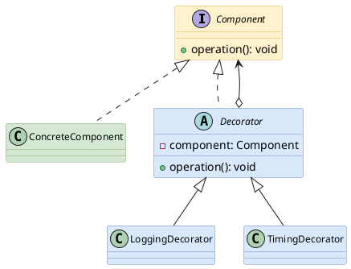

### Java 示例

```java
interface Processor {
    String process(String input);
}

class BasicProcessor implements Processor {
    public String process(String input) {
        return input.trim();
    }
}

abstract class ProcessorDecorator implements Processor {
    protected final Processor delegate;

    ProcessorDecorator(Processor delegate) {
        this.delegate = delegate;
    }
}

class UpperCaseDecorator extends ProcessorDecorator {
    UpperCaseDecorator(Processor delegate) { super(delegate); }

    public String process(String input) {
        return delegate.process(input).toUpperCase();
    }
}
```

### 适用场景
- 功能需要按需叠加，组合顺序也可能变化。
- 不想通过继承产生大量子类。
- 需要在运行时决定增强行为。

### 注意事项
- 装饰链过长会影响调试。
- 装饰器应保持同一接口语义，不要偷偷改变核心契约。

---

## 10. 外观模式（Facade）

**意图**：为复杂子系统提供一个统一、简洁的高层接口。

### 类图

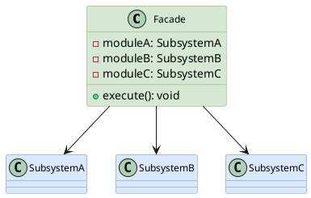

### Java 示例

```java
class ModuleA { void stepA() {} }
class ModuleB { void stepB() {} }
class ModuleC { void stepC() {} }

class WorkflowFacade {
    private final ModuleA moduleA = new ModuleA();
    private final ModuleB moduleB = new ModuleB();
    private final ModuleC moduleC = new ModuleC();

    public void execute() {
        moduleA.stepA();
        moduleB.stepB();
        moduleC.stepC();
    }
}
```

### 适用场景
- 子系统调用步骤复杂，外部只需要一个简单入口。
- 想降低客户端与多个模块之间的耦合。
- 需要封装一段标准流程。

### 注意事项
- 外观不是万能服务类，不要把所有逻辑都堆进去。
- 子系统仍可保留细粒度接口，外观只是提供常用入口。

---

## 11. 享元模式（Flyweight）

**意图**：共享大量细粒度对象的内部状态，减少内存占用。

### 类图

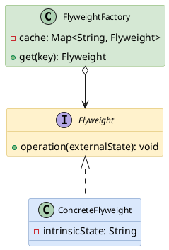

### Java 示例

```java
interface Glyph {
    void draw(int x, int y);
}

class CharacterGlyph implements Glyph {
    private final char symbol;

    CharacterGlyph(char symbol) {
        this.symbol = symbol;
    }

    public void draw(int x, int y) {
        System.out.printf("%s at (%d,%d)%n", symbol, x, y);
    }
}

class GlyphFactory {
    private final Map<Character, Glyph> cache = new HashMap<>();

    public Glyph get(char symbol) {
        return cache.computeIfAbsent(symbol, CharacterGlyph::new);
    }
}
```

### 适用场景
- 存在大量相似对象，且可拆分内部状态和外部状态。
- 内部状态可共享，外部状态由调用方传入。
- 对内存占用比较敏感。

### 注意事项
- 不要为了少量对象引入享元。
- 必须明确哪些状态可共享，哪些状态不能共享。

---

## 12. 代理模式（Proxy）

**意图**：为目标对象提供替身，以控制访问、延迟加载、记录日志或增加保护。

### 类图

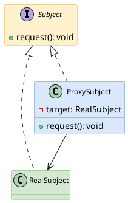

### Java 示例

```java
interface Service {
    void request();
}

class RealService implements Service {
    public void request() {
        System.out.println("real request");
    }
}

class ServiceProxy implements Service {
    private final Service target;

    ServiceProxy(Service target) {
        this.target = target;
    }

    public void request() {
        long start = System.currentTimeMillis();
        try {
            target.request();
        } finally {
            System.out.println("cost=" + (System.currentTimeMillis() - start));
        }
    }
}
```

### 适用场景
- 需要控制访问权限。
- 需要延迟创建重量级对象。
- 需要在调用前后附加日志、监控、事务等横切能力。

### 注意事项
- 代理和装饰器结构相似：代理强调控制访问，装饰器强调增强能力。
- 代理层过多会让调用链变长，定位问题更困难。

---

# 三、行为型模式（Behavioral Patterns）

> 行为型模式关注“对象之间如何协作”。它们帮助我们组织流程、分派职责、封装算法、解耦通知与状态变化。

## 13. 职责链模式（Chain of Responsibility）

**意图**：让多个处理器按链式结构依次处理请求，直到某个处理器处理完成或链路结束。

### 类图

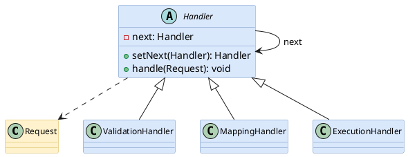

### Java 示例

```java
class RequestContext {
    private final Map<String, Object> attributes = new HashMap<>();
}

abstract class Handler {
    private Handler next;

    public Handler setNext(Handler next) {
        this.next = next;
        return next;
    }

    public final void handle(RequestContext context) {
        doHandle(context);
        if (next != null) {
            next.handle(context);
        }
    }

    protected abstract void doHandle(RequestContext context);
}

class ValidateHandler extends Handler {
    protected void doHandle(RequestContext context) {
        System.out.println("validate");
    }
}
```

### 适用场景
- 请求需要经过多个步骤处理。
- 每个步骤可独立增删、排序或复用。
- 不希望请求发送者知道具体处理者。

### 注意事项
- 链路太长会增加排查成本。
- 要明确中断规则：是每个节点都执行，还是某个节点可终止链路。

---

## 14. 命令模式（Command）

**意图**：把请求封装成对象，使请求可排队、撤销、记录或组合。

### 类图

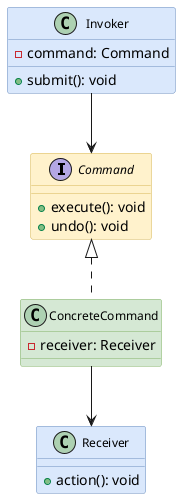

### Java 示例

```java
interface Command {
    void execute();
    default void undo() {}
}

class Receiver {
    void action(String value) {
        System.out.println("action: " + value);
    }
}

class PrintCommand implements Command {
    private final Receiver receiver;
    private final String value;

    PrintCommand(Receiver receiver, String value) {
        this.receiver = receiver;
        this.value = value;
    }

    public void execute() {
        receiver.action(value);
    }
}

class CommandQueue {
    private final Queue<Command> queue = new ArrayDeque<>();

    void add(Command command) { queue.add(command); }
    void runAll() { while (!queue.isEmpty()) queue.poll().execute(); }
}
```

### 适用场景
- 操作需要排队、重试、撤销或记录。
- 调用者和执行者需要解耦。
- 需要把一组操作组合成宏命令。

### 注意事项
- 简单方法调用不要包装成命令对象。
- 如果命令需要撤销，要保存足够的历史状态。

---

## 15. 迭代器模式（Iterator）

**意图**：在不暴露集合内部结构的前提下，顺序访问聚合对象中的元素。

### 类图

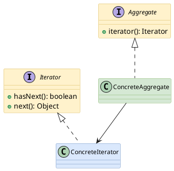

### Java 示例

```java
class SimpleList<T> implements Iterable<T> {
    private final List<T> values = new ArrayList<>();

    public void add(T value) {
        values.add(value);
    }

    public Iterator<T> iterator() {
        return values.iterator();
    }
}
```

### 适用场景
- 需要遍历集合，但不想暴露内部存储结构。
- 需要支持多种遍历方式。
- 集合结构可能变化，但遍历接口保持稳定。

### 注意事项
- Java 集合框架已经内置 Iterator，通常直接使用即可。
- 自定义迭代器要注意并发修改问题。

---

## 16. 中介者模式（Mediator）

**意图**：用一个中介对象封装多个对象之间的交互，降低对象之间的网状依赖。

### 类图

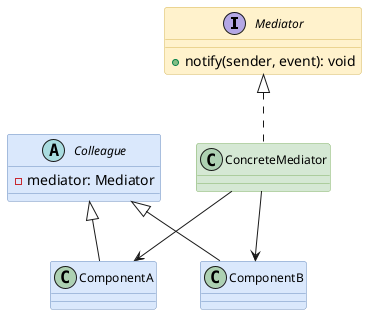

### Java 示例

```java
interface Mediator {
    void notify(Component sender, String event);
}

abstract class Component {
    protected final Mediator mediator;

    protected Component(Mediator mediator) {
        this.mediator = mediator;
    }
}

class InputComponent extends Component {
    InputComponent(Mediator mediator) { super(mediator); }

    void change() {
        mediator.notify(this, "changed");
    }
}

class FormMediator implements Mediator {
    public void notify(Component sender, String event) {
        System.out.println(sender.getClass().getSimpleName() + ":" + event);
    }
}
```

### 适用场景
- 多个对象互相调用，依赖关系变成网状。
- 需要集中协调一组组件的交互流程。
- 组件本身希望保持简单。

### 注意事项
- 中介者容易膨胀成“上帝对象”。
- 适合协调交互，不适合承载所有业务规则。

---

## 17. 备忘录模式（Memento）

**意图**：在不破坏封装的情况下保存对象状态，并在需要时恢复。

### 类图

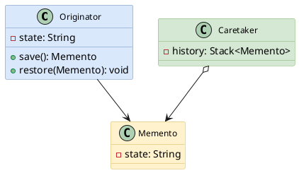

### Java 示例

```java
class Editor {
    private String content = "";

    public void write(String text) {
        content += text;
    }

    public Snapshot save() {
        return new Snapshot(content);
    }

    public void restore(Snapshot snapshot) {
        this.content = snapshot.content;
    }

    static class Snapshot {
        private final String content;
        private Snapshot(String content) { this.content = content; }
    }
}
```

### 适用场景
- 需要撤销、回滚、历史版本。
- 不希望外部对象直接读取或修改内部状态。
- 状态快照可被安全保存。

### 注意事项
- 快照很大时要考虑内存成本。
- 复杂对象可采用增量快照或命令日志替代完整快照。

---

## 18. 观察者模式（Observer）

**意图**：对象状态变化时，自动通知依赖它的多个观察者。

### 类图

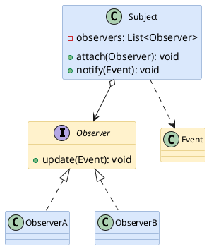

### Java 示例

```java
interface Observer {
    void update(Event event);
}

record Event(String name, Object payload) {}

class EventSubject {
    private final List<Observer> observers = new ArrayList<>();

    void attach(Observer observer) {
        observers.add(observer);
    }

    void publish(Event event) {
        for (Observer observer : observers) {
            observer.update(event);
        }
    }
}
```

### 适用场景
- 一个事件发生后，需要通知多个独立处理者。
- 发布者不关心订阅者是谁。
- 希望降低事件源与后续动作之间的耦合。

### 注意事项
- 同步通知可能拖慢主流程。
- 观察者异常处理、顺序、幂等性要设计清楚。

---

## 19. 状态模式（State）

**意图**：把对象在不同状态下的行为封装到独立状态类中，使对象行为随状态改变而改变。

### 类图

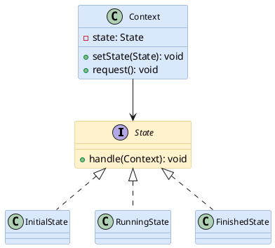

### Java 示例

```java
interface State {
    void handle(ProcessContext context);
}

class ProcessContext {
    private State state;

    ProcessContext(State state) {
        this.state = state;
    }

    void setState(State state) {
        this.state = state;
    }

    void request() {
        state.handle(this);
    }
}

class InitialState implements State {
    public void handle(ProcessContext context) {
        context.setState(new RunningState());
    }
}

class RunningState implements State {
    public void handle(ProcessContext context) {
        context.setState(new FinishedState());
    }
}

class FinishedState implements State {
    public void handle(ProcessContext context) {
        System.out.println("done");
    }
}
```

### 适用场景
- 对象行为依赖状态，并且状态转换规则较多。
- 代码里出现大量 if/else 或 switch 判断状态。
- 希望把状态行为和转换逻辑局部化。

### 注意事项
- 状态少且逻辑简单时，枚举加 switch 更容易读。
- 状态转换关系要集中可视化，否则类多后容易迷路。

---

## 20. 策略模式（Strategy）

**意图**：定义一系列算法，把每个算法封装起来，并让它们可以相互替换。

### 类图

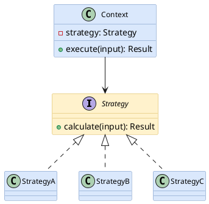

### Java 示例

```java
interface SortStrategy {
    List<Integer> sort(List<Integer> values);
}

class AscSortStrategy implements SortStrategy {
    public List<Integer> sort(List<Integer> values) {
        return values.stream().sorted().toList();
    }
}

class DescSortStrategy implements SortStrategy {
    public List<Integer> sort(List<Integer> values) {
        return values.stream().sorted(Comparator.reverseOrder()).toList();
    }
}

class SortContext {
    private final SortStrategy strategy;

    SortContext(SortStrategy strategy) {
        this.strategy = strategy;
    }

    List<Integer> execute(List<Integer> values) {
        return strategy.sort(values);
    }
}
```

### 适用场景
- 多个算法可以互换。
- 算法选择可由配置、参数或运行时条件决定。
- 想消除一堆算法分支判断。

### 注意事项
- 策略类太细可能造成类爆炸。
- 客户端需要知道如何选择策略，可配合工厂或注册表。

---

## 21. 模板方法模式（Template Method）

**意图**：在父类中定义算法骨架，把某些步骤延迟到子类实现。

### 类图

```plantuml
@startuml
skinparam class {
  BackgroundColor #dae8fc
  BorderColor #6c8ebf
  FontName "Microsoft YaHei"
  FontSize 12
}
skinparam note {
  BackgroundColor #fff2cc
  BorderColor #d6b656
}

abstract class AbstractProcess #dae8fc;line:6c8ebf {
  +execute(): void
  #stepOne(): void
  #stepTwo(): void
  #hook(): void
}
class ConcreteProcessA #d5e8d4;line:82b366
class ConcreteProcessB #d5e8d4;line:82b366
AbstractProcess <|-- ConcreteProcessA
AbstractProcess <|-- ConcreteProcessB
@enduml
```

### Java 示例

```java
abstract class AbstractTask {
    public final void execute() {
        prepare();
        doExecute();
        cleanup();
    }

    protected void prepare() {
        System.out.println("prepare");
    }

    protected abstract void doExecute();

    protected void cleanup() {
        System.out.println("cleanup");
    }
}

class TextTask extends AbstractTask {
    protected void doExecute() {
        System.out.println("text task");
    }
}
```

### 适用场景
- 多个流程步骤基本一致，只有个别步骤不同。
- 希望统一流程顺序，避免子类随意改变。
- 框架提供骨架，扩展方实现细节。

### 注意事项
- 父类过重会限制扩展。
- 如果变化点很多，策略模式或组合方式可能更灵活。

---

# 附录 A：21 种模式速查表

| 类型 | 模式 | 核心关键词 | 主要解决的问题 |
|---|---|---|---|
| 创建型 | Singleton | 唯一实例 | 控制对象数量 |
| 创建型 | Factory Method | 延迟创建 | 子类决定创建什么 |
| 创建型 | Abstract Factory | 对象族 | 一组相关对象的一致创建 |
| 创建型 | Builder | 分步构建 | 复杂对象构造 |
| 创建型 | Prototype | 复制 | 基于模板创建对象 |
| 结构型 | Adapter | 接口转换 | 兼容旧接口或第三方接口 |
| 结构型 | Bridge | 分离维度 | 抽象与实现独立变化 |
| 结构型 | Composite | 树结构 | 统一处理单个对象和集合 |
| 结构型 | Decorator | 动态增强 | 不改原类扩展功能 |
| 结构型 | Facade | 统一入口 | 简化复杂子系统调用 |
| 结构型 | Flyweight | 共享 | 减少大量对象内存开销 |
| 结构型 | Proxy | 访问控制 | 代理目标对象调用 |
| 行为型 | Chain | 链式处理 | 动态组织处理步骤 |
| 行为型 | Command | 请求对象化 | 排队、撤销、记录操作 |
| 行为型 | Iterator | 遍历 | 隐藏集合内部结构 |
| 行为型 | Mediator | 集中协调 | 降低对象网状依赖 |
| 行为型 | Memento | 快照 | 保存和恢复状态 |
| 行为型 | Observer | 发布订阅 | 状态变化通知多个对象 |
| 行为型 | State | 状态对象 | 状态驱动行为变化 |
| 行为型 | Strategy | 算法替换 | 消除算法分支 |
| 行为型 | Template Method | 流程骨架 | 固定流程，开放步骤 |

---

# 附录 B：模式关系图

```plantuml
@startuml
skinparam rectangle {
  BackgroundColor #dae8fc
  BorderColor #6c8ebf
  FontName "Microsoft YaHei"
}
skinparam package {
  BackgroundColor #f8cecc
  BorderColor #b85450
}

package "创建型" {
  rectangle "Singleton\n唯一实例" as singleton
  rectangle "Factory Method\n延迟创建" as factory
  rectangle "Abstract Factory\n对象族" as abstractFactory
  rectangle "Builder\n分步构建" as builder
  rectangle "Prototype\n复制模板" as prototype
}

package "结构型" {
  rectangle "Adapter\n接口转换" as adapter
  rectangle "Bridge\n分离维度" as bridge
  rectangle "Composite\n树结构" as composite
  rectangle "Decorator\n动态增强" as decorator
  rectangle "Facade\n统一入口" as facade
  rectangle "Flyweight\n共享对象" as flyweight
  rectangle "Proxy\n访问控制" as proxy
}

package "行为型" {
  rectangle "Chain\n链式处理" as chain
  rectangle "Command\n请求对象化" as command
  rectangle "Iterator\n遍历" as iterator
  rectangle "Mediator\n集中协调" as mediator
  rectangle "Memento\n状态快照" as memento
  rectangle "Observer\n事件通知" as observer
  rectangle "State\n状态行为" as state
  rectangle "Strategy\n算法替换" as strategy
  rectangle "Template Method\n流程骨架" as template
}

factory --> abstractFactory : 多个产品形成对象族
builder --> prototype : 都可降低复杂创建成本
adapter --> facade : 都可包一层接口
proxy --> decorator : 结构相似，意图不同
state --> strategy : 都封装可替换行为
command --> memento : 撤销常配合快照
observer --> mediator : 都用于对象协作解耦
@enduml
```

---

# 附录 C：选型决策流程

```plantuml
@startuml
skinparam activity {
  BackgroundColor #dae8fc
  BorderColor #6c8ebf
  FontName "Microsoft YaHei"
}
skinparam diamond {
  BackgroundColor #fff2cc
  BorderColor #d6b656
}

start
:先描述变化点;
if (问题在对象创建?) then (是)
  if (只需要一个实例?) then (是)
    :Singleton;
  elseif (对象构造步骤复杂?) then (是)
    :Builder;
  elseif (需要创建对象族?) then (是)
    :Abstract Factory;
  elseif (子类决定创建对象?) then (是)
    :Factory Method;
  else
    :Prototype;
  endif
elseif (问题在结构组合?) then (是)
  if (接口不兼容?) then (是)
    :Adapter;
  elseif (需要动态增强?) then (是)
    :Decorator;
  elseif (需要统一入口?) then (是)
    :Facade;
  elseif (需要树结构?) then (是)
    :Composite;
  elseif (访问需要控制?) then (是)
    :Proxy;
  else
    :Bridge / Flyweight;
  endif
else
  if (算法可替换?) then (是)
    :Strategy;
  elseif (状态驱动行为?) then (是)
    :State;
  elseif (请求要排队/撤销?) then (是)
    :Command;
  elseif (多个对象需要通知?) then (是)
    :Observer;
  elseif (流程骨架固定?) then (是)
    :Template Method;
  else
    :Chain / Mediator / Iterator / Memento;
  endif
endif
stop
@enduml
```

---

# 附录 D：常见误区

1. **把模式当目标，而不是手段**  
   设计模式是为了解决变化和复杂度，不是为了让代码看起来“高级”。

2. **过早抽象**  
   变化点没有出现时，强行抽象往往只会增加阅读成本。

3. **类名直接叫 XxxPattern**  
   类名应该表达业务/技术职责，例如 `SortStrategy`、`ServiceProxy`，而不是 `StrategyPatternDemo`。

4. **只看类图，不看意图**  
   很多模式结构相似，例如代理和装饰器，但意图完全不同。

5. **忽视测试成本**  
   模式引入更多协作对象后，应配套单元测试覆盖关键变化点。

---

# 附录 E：PlantUML 颜色约定

```plantuml
@startuml
skinparam class {
  FontName "Microsoft YaHei"
  FontSize 12
}
class "接口/抽象" as A #fff2cc;line:d6b656
class "核心实现" as B #d5e8d4;line:82b366
class "上下文/协调者" as C #dae8fc;line:6c8ebf
class "辅助对象" as D #f8cecc;line:b85450

A <|.. B
C --> A
D ..> C
@enduml
```

- 黄色：接口、抽象、契约。
- 绿色：具体实现、核心对象。
- 蓝色：上下文、管理器、协调者。
- 红色：辅助对象、外部协作者或需要特别关注的对象。

---

## 总结

设计模式的价值不在于“背会 21 个名字”，而在于识别变化点：

- 创建复杂，就考虑创建型模式。
- 结构混乱，就考虑结构型模式。
- 协作难维护，就考虑行为型模式。

真正好的设计通常不是一上来就套模式，而是在代码复杂度增长到某个临界点时，用恰当的模式把变化关进笼子里。模式用得好，代码像收纳盒；模式用过头，代码像套娃。区别就在于：你到底是在解决问题，还是在制造仪式感。
